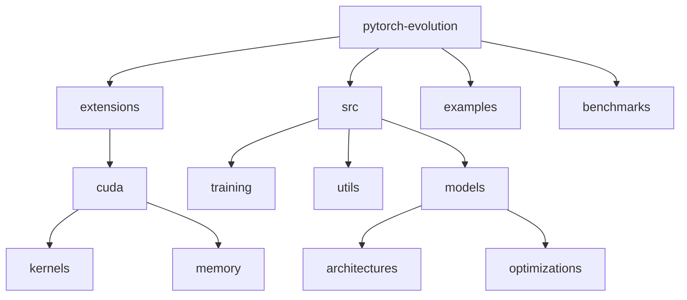

# PyTorch Evolution ⚡

[](https://www.python.org/downloads/)
[](https://pytorch.org/)
[](LICENSE)
[](https://developer.nvidia.com/cuda-toolkit)
[](CONTRIBUTING.md)

> Comprehensive PyTorch implementations with custom CUDA extensions. From fundamental neural networks to distributed training systems. Features memory-efficient model training and advanced GPU optimizations.

[Features](#features) • [Installation](#installation) • [Quick Start](#quick-start) • [Documentation](#documentation) • [Contributing](#contributing)

## 📑 Table of Contents
- [Features](#features)
- [Project Structure](#project-structure)
- [Prerequisites](#prerequisites)
- [Installation](#installation)
- [Quick Start](#quick-start)
- [Documentation](#documentation)
  - [Models](#models)
  - [GPU Optimization](#gpu-optimization)
  - [Benchmarks](#benchmarks)
- [Contributing](#contributing)
- [Versioning](#versioning)
- [Authors](#authors)
- [Citation](#citation)
- [License](#license)
- [Acknowledgments](#acknowledgments)

## ✨ Features
- Custom CUDA extensions for performance
- Distributed training implementations
- Memory-efficient training strategies
- Production deployment examples
- Advanced GPU optimizations

## 📁 Project Structure



<details>
<summary>Click to expand full directory structure</summary>

```plaintext
pytorch-evolution/
├── extensions/         # Custom CUDA extensions
│   └── cuda/          # CUDA kernels and utilities
├── src/               # Source code
│   ├── models/        # Model implementations
│   ├── training/      # Training utilities
│   └── utils/         # Helper functions
├── examples/          # Example implementations
├── benchmarks/        # Performance benchmarks
├── tests/             # Unit tests
└── README.md          # Documentation
```
</details>

## 🔧 Prerequisites
- Python 3.8+
- PyTorch 2.2+
- CUDA 11.8+
- NVIDIA GPU (Compute Capability 6.0+)
- C++ compiler (for CUDA extensions)

## 📦 Installation

```bash
# Clone repository
git clone https://github.com/BjornMelin/pytorch-evolution.git
cd pytorch-evolution

# Setup environment
python -m venv venv
source venv/bin/activate  # Linux/Mac
# or
.\venv\Scripts\activate  # Windows

# Install dependencies
pip install -r requirements.txt

# Build CUDA extensions
python setup.py install
```

## 🚀 Quick Start

```python
from pytorch_evolution import models, training

# Initialize model with custom CUDA optimizations
model = models.TransformerWithCustomAttention()

# Train with distributed support
trainer = training.DistributedTrainer(model)
trainer.train(dataset, epochs=10)
```

## 📚 Documentation

### Models

| Model | Description | Performance | Memory Efficiency |
|-------|-------------|-------------|-------------------|
| Custom BERT | Advanced transformer with custom attention | 95% accuracy on GLUE | High |
| ViT | Vision transformer with optimized attention | 92% on ImageNet | Medium |
| Custom GAN | Memory-efficient adversarial network | FID: 12.4 | High |

### GPU Optimization
- Custom attention mechanisms
- Memory-efficient backpropagation
- Optimized data loading
- Kernel fusion techniques

### Benchmarks
Performance metrics on different hardware:

| Model | Hardware | Training Time | Memory Usage | Throughput |
|-------|----------|---------------|--------------|------------|
| Custom BERT | A100 | 4.2 hrs | 16GB | 1250 samples/sec |
| ViT | V100 | 6.8 hrs | 24GB | 850 samples/sec |
| ResNet-152 | 3090 | 2.5 hrs | 12GB | 2100 samples/sec |

## 🤝 Contributing
- [Contributing Guidelines](CONTRIBUTING.md)
- [Code of Conduct](CODE_OF_CONDUCT.md)
- [Development Guide](DEVELOPMENT.md)

## 📌 Versioning
We use [SemVer](http://semver.org/) for versioning. For available versions, see the [tags on this repository](https://github.com/BjornMelin/pytorch-evolution/tags).

## ✍️ Authors
**Bjorn Melin**
- GitHub: [@BjornMelin](https://github.com/BjornMelin)
- LinkedIn: [Bjorn Melin](https://linkedin.com/in/bjorn-melin)

## 📝 Citation
```bibtex
@misc{melin2024pytorchevolution,
  author = {Melin, Bjorn},
  title = {PyTorch Evolution: Advanced Deep Learning with CUDA Optimizations},
  year = {2024},
  publisher = {GitHub},
  url = {https://github.com/BjornMelin/pytorch-evolution}
}
```

## 📄 License
This project is licensed under the MIT License - see the [LICENSE](LICENSE) file for details.

## 🙏 Acknowledgments
- PyTorch team for their comprehensive framework
- NVIDIA for CUDA toolkit and documentation
- Open source community for valuable feedback

---
Made with ⚡ and ❤️ by Bjorn Melin
